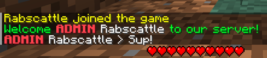
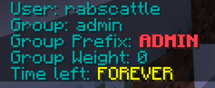
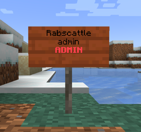

# Groups

## Aufgabenbeschreibung

Das Plugin soll als Gruppen/Berechtigungssystem wie zum Beispiel Pex oder LuckyPerms fungieren. Dem
Spieler soll sich standardmäßig in einer Gruppe befinden. Ggf. kann diesem eine andere Gruppe
permanent oder für eine gewisse Zeit zugewiesen werden. Alle nötigen Informationen sollen in einer
relationalen Datenbank gespeichert werden.

## Preamble

Das Plugin ist momentan konzipiert um auf der Version 1.19 zu laufen.
Die meisten Commands sind unten aufgelistet. Um eine komplette Liste zu erhalten,
benutzt die Befehle help, um eine genauere Auflistung zu erhalten. Hier sind weitere
sinnvolle Commands:

- groups reload (Reloaden der Konfigurationsdatei und Messages)

## Frameworks & Help

https://github.com/aikar/commands

<p>
Für die Commands wird das ACF (Annotation Command Framework) verwendet.
welches ich im Nachhinein bereue und ich bei gelegenheit
mit einem eigenen Auswechseln würde.
</p>

https://github.com/JordanOsterberg/JScoreboards

<p>
Für den Scoreboard Branch (welche eine unfertige Version von 
Scoreboards und der Tabliste beinhaltet) wurde JScoreboards
von Jordan Osterberg verwendet.
</p>

https://github.com/LuckPerms/LuckPerms

<p>
Aufgrund der bereits jahren lange Arbeit mit LuckPerms habe ich viele 
Ideen und Konzepte übernommen, kein Code kopiert. Zum Beispiel wird eine ähnliche Struktur
für die Manager (User & Group), welche ihre Objekte zuerst erstellen und dann von der Datenbank geladen,
welches ich ganz nett fand. Außerdem haben User und Gruppen 
keine direkten Variablen (Aus UML Sicht). Sondern alles wird über
Permissions geregelt, wie zum Beispiel dem Präfix und die Gewichtung
</p>

## Mindestanforderung

### Gruppen können im Spiel erstellt und verwaltet werden

Gruppen werden mit dem Hauptcommand group verwaltet.
Untercommands sind unter anderem:

- group create
- group delete
- group prefix set
- group prefix add
- group prefix clear
- group weight set
- group weight add
- group weight clear
- group perm set
- group perm remove

### Die Gruppe muss mindestens folgende Eigenschaften haben

#### Name

Der Name einer Gruppe ist und fest kann nicht verändert worden. Er ist zugleich auch
Identifikator einer Gruppe

#### Präfix

Präfixe werden über Permissions mit einer bestimmten Syntax geregelt.
Diese lautet: `prefix.<weight>.<prefix>`. Dem Präfix mit der höchsten Gewichtung wird verwendet

### Spieler soll einer Gruppe zugewiesen werden können (Permanent und mit einer Zeitangabe)

Spielern/Users werden mit dem Hautpcommand user verwaltet
Untercommands sind unter anderem:

- user group set
- user group remove
- user group add
- user perm set
- user perm remove
- user info

Bei allen Kommandos kann eine Zeitangabe mit angegeben werden. Diese
aber im englischen Format. Bsp: 5d 5s = 5 Tage 5 Sekunden

### Präfix von der Gruppe soll im Chat und beim Betreten des Servers angezeigt werden<br>



### Wenn der Spieler eine neue Gruppe zugewiesen bekommt, soll diese sich unmittelbar ändern (Spieler soll nicht gekickt werden)

### Alle Nachrichten sollen in einer Konfigurationsdatei anpassbar sein

Siehe hierzu den Unterpunkt: Messages

### Durch einen Befehl erfährt der Spieler seine aktuelle Gruppe und ggf. wie lange er diese noch hat

Der Spieler hat die Möglichkeit (sofern er die Berechtigung dazu hat)
mit dem Befehl `/rank` folgende Ausgabe (Konfigurierbar) zu erhalten: <br>


### Ein oder mehrere Schilde sollen hinzugefügt werden können, die Informationen eines einzelnen Spielers wie Name & Rang anzeigen

Spieler können ein Schild welches folgendes Schlüsselwort enthalten muss: `group-sign`
aufstellen. Danach formatiert sich das Schild wie folgt (konfigurierbar inklusive Sprache):<br>


### Alle nötigen Information werden in einer relationalen Datenbank gespeichert (konfigurierbare Texte nicht)

Eine bereits erstellte Datenbank ist erforderlich. Momentan steht dem Benutzer nur MYSQL und MARIADB
als Datenbank zur verfügung

## Bonus Aufgaben

### Für eine Gruppe können Berechtigungen festgelegt und sollen dem Spieler dementsprechend zugewiesen werden. Abfrage über #hasPermission sollte funktionieren

Nicht implementiert. Momentan wird keine Beziehung/Erbe von Usern und deren Gruppen der
Berechtigungen hergestellt

### (*) Berechtigung

Berechtigungen werden als Wildcards aufgelöst. * Berechtigung würde funktionieren.

### Unterstützung von mehreren Sprachen

Siehe hierzu den Unterpunkt: Messages

### Tabliste und Scoreboard

Beides sind im Branch scoreboard implementiert. Doch aufgrund der instabilität des genutzten
Frameworks
wird dies nicht in der Aufgabe mit abgegeben.

## Messages

<p>
Das Plugin benutzt ein dynamisch erweiterbares sprach/Nachrichten System
und unterstützt beliebig viele Sprachen.
Dazu erstellt man in dem Ordner `Groups/languages` eine message datei.

### Auswählen einer Sprache

Momentan ist englisch (en) immer die default sprache.
Damit ein Spieler seine Sprache ändern kann, bedarf es den Befehl:
`language set <language-code>`. Die Sprache muss vorher konfiguriert sein!

### Dateiname und Endung

<p>
Der Name dieser Datei muss einem bestimmten Format entsprechen, um von dem
System erkannt zu werden. Das format sieht wie folgt aus: <br>

Format: `messages-(language-code).yml` <br>
Beispiel (englisch): `messages-en.yml` <br>
</p>

### Befüllen von Sprachen

Zum Erstellen seiner eigenen Sprache, schaut man sich die `LangKeys.java` genauer an.
Dort stehen alle Nachrichten welche verändert werden können.
Um nun zum Beispiel die `LangKeys.GREET` (Die Nachricht, die beim Betreten des Servers gesendet
wird)
anzupassen, tut man das wie folgt:

```yml
#messages-en.yml
greet:
  msg: "Welcome to the server!"
```

```yml
#messages-de.yml
greet:
  # Nachricht wird nicht gesendet, sollte der Inhalt leer sein!
  msg: ""
  # Erstellen von Titeln
  title:
    title: "Willkommen"
    subtitle: "Auf dem Server"
```

Momentan gibt es zwei Arten von Nachrichten, welche man erstellen kann.
Chat Nachrichten und Titel. Die beiden sollten selbsterklärend sein.

## Setup

Im Release Verzeichnis hier in GitHub findet man die neuste Version,
sowie ein Docker container welchen man ebenfalls benutzen kann.

### Plugin Version

https://github.com/domcoon/Groups/releases/download/1.0/groups-1.0-SNAPSHOT-all.jar

Um das Plugin in einer eigenen Umgebung zu benutzen, bedarf
es vorerst eine vorkonfigurierte Datenbank. Vorkonfiguriert im Sinne von,
es muss eine Datenbank erstellt werden (damit ist nicht das Aufsetzen einer Verbindung gemeint).
Ein neustart ist erforderlich um die Verbindung herzustellen.
Das Plugin sollte einmalig gestartet werden, um die Konfigurationen
und Ordner zu laden.

### Docker Version

### Vor-Installation

Installiere Docker & Docker Compose für dein Betriebssystem
Befolge alle Schritte von der Seite https://docs.docker.com/get-docker/

### Einrichten

1. Download: https://github.com/domcoon/Groups/releases/download/1.0/plugin-test-docker.zip
2. Entpacke die .zip datei
3. Öffne ein Terminal in dem entpackten Ordner
4. Starte den Container mit: `docker-compose up -d`
5. (Optional) zum Einloggen in die Console nutze folgenden befehl: `docker attach plugin-test`

### Beitreten

Der Server läuft nun auf `localhost:4321` in der Server Version 1.19
Alle benötigten Datenbanken wurden bereits erstellt und laufen
auf einem MariaDB Client.


